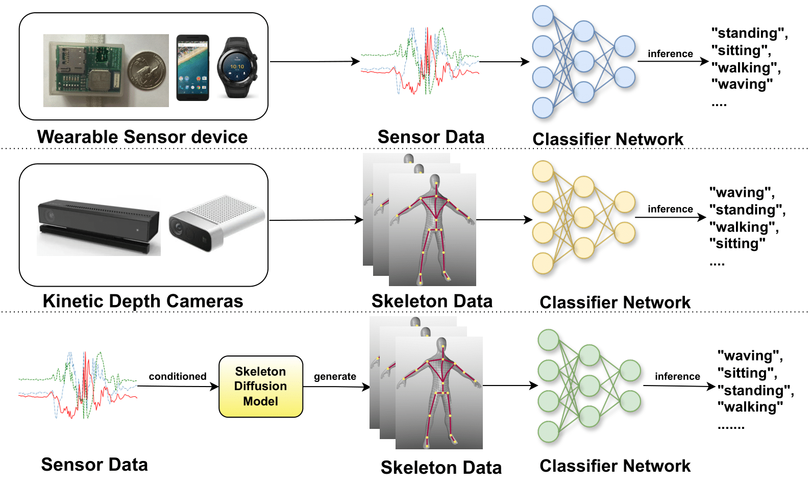
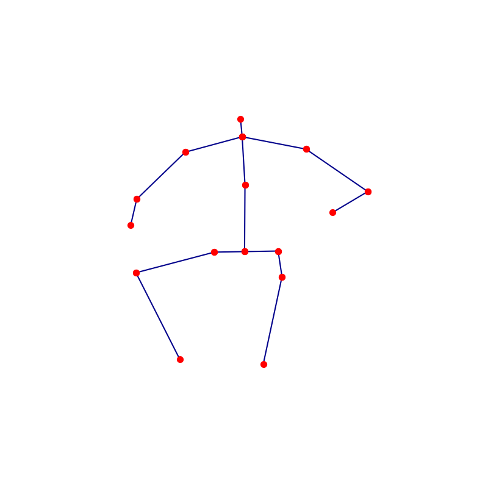
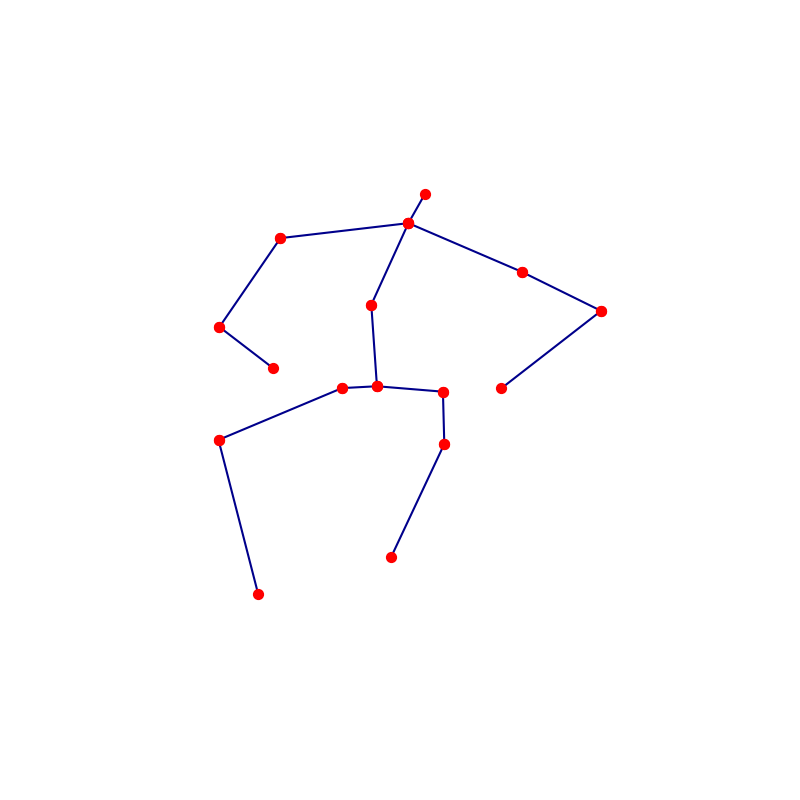

### SSDL: Sensor-to-Skeleton Diffusion Model with Lipschitz Regularization for Human Activity Recognition ###

This repository contains the implementation of **SSDL**, a Sensor-to-Skeleton Diffusion Model, for generating skeleton data from sensor inputs to perform **Human Activity Recognition (HAR)**. The model incorporates **Angular Variations** and **Lipschitz Regularization** to improve accuracy and robustness on noisy sensor data.


## Introduction
SSDL is a diffusion-based model designed to generate skeleton data conditioned on wearable sensor data. It addresses key challenges in sensor-based HAR, such as noise and instability, by employing **Lipschitz Regularization** to improve the robustness of generated data. SSDL has been tested on three benchmark datasets: **UTD-MHAD**, **Berkeley-MHAD**, and **SmartFall-MHAD**, showing state-of-the-art performance.


## Features
- **Cross-modal generation**: Generates skeleton key points from sensor inputs.
- **Angular Variations Module**: Extracts key joint movements to guide diffusion.
- **Lipschitz Regularization**: Stabilizes the model's performance with noisy sensor inputs.

## Installation
1. Clone the repository:
    ```bash
    git clone https://github.com/nikhiliit/SSDL-S2S-Diffusion-Model-with-LR-for-HAR.git
    cd SSDL-S2S-Diffusion-Model-with-LR-for-HAR
    ```

2. Install dependencies:
    ```bash
    pip install -r requirements.txt
    ```

The training code in this repository utilizes **Distributed Data Parallel (DDP)** in PyTorch to take advantage of multiple GPUs for faster training. DDP replicates the model on each GPU and synchronizes gradients across devices, which helps to scale training efficiently without sacrificing performance.

### Requirements for Running DDP Code:
- **Multiple GPUs**: To use DDP, your system must have multiple GPUs (or use multiple nodes with one or more GPUs per node).
- **NCCL**: DDP typically uses NCCL as the backend for communication between GPUs.

## Training the Model

To train the **SSDL** model, several key parameters and configurations can be adjusted to control the training process. Below is an overview of the main arguments that you can modify:

### Seed
- **`--seed`**: Set a seed value to ensure reproducibility during training.

### Learning Rates
- **`--sensor_lr`**: Learning rate for the sensor model.
- **`--skeleton_lr`**: Learning rate for the skeleton model.
- **`--diffusion_lr`**: Learning rate for the diffusion process.

### Training Flags
- **`--train_sensor_model`**: Set to `True` to train the sensor model. Set to `False` to train the diffusion model.
- **`--train_skeleton_model`**: Set to `True` to train the skeleton model. If the skeleton model is already trained, set this to `False` to skip skeleton training.

### Dataset Configuration
- **`--overlap`** and **`--window_size`**: Control how the sliding window is applied to the dataset for sensor and skeleton data.
- **`--skeleton_folder`**, **`--sensor_folder1`**, and **`--sensor_folder2`**: These are the paths to the skeleton and sensor data directories.

### Epochs
- **`--epochs`**: Total number of epochs for training the diffusion model.
- **`--sensor_epoch`**: Number of epochs for training the sensor model.
- **`--skeleton_epochs`**: Number of epochs for training the skeleton model.

### Model Path and Batch Size
- **`--sensor_model_path`**: Defines the path to the pre-trained sensor model. It can be used to load the model and continue training.
- **`--batch_size`**: Specifies the batch size used during training.

### Distributed Training
- **`--world_size`**: Defines the number of GPUs to use for training. If you have multiple GPUs, you can utilize **Distributed Data Parallel (DDP)** to accelerate the training process.

### Diffusion Process
- **`--timesteps`**: Sets the number of timesteps for the forward and reverse diffusion process.
- **`--ddim_scale`**: Controls the scale factor for the DDIM (Denoising Diffusion Implicit Models) process.

### Loss Functions
- **`--angular_loss`**: When enabled, this adds angular loss to ensure that the joint angles between skeleton keypoints are consistent.
- **`--lip_reg`**: Enables the Lipschitz Regularization (LR) module, which helps stabilize training when sensor data is noisy.

---

## How to Train the Model

### 1. Set the Learning Rates
Decide on the learning rates for the sensor model, skeleton model, and diffusion model. Adjust them using the corresponding arguments (`--sensor_lr`, `--skeleton_lr`, `--diffusion_lr`).

### 2. Choose Which Models to Train
- To train the **sensor model**, set `--train_sensor_model` to `True`.
- To train the **skeleton model**, set `--train_skeleton_model` to `True`. If the skeleton model is already trained, set this to `False` to skip its training.

### 3. Configure Dataset Paths
Make sure to specify the correct directories for your skeleton and sensor data using the `--skeleton_folder`, `--sensor_folder1`, and `--sensor_folder2` arguments.

### 4. Set the Number of Epochs
Determine how many epochs to train each model using the `--epochs`, `--sensor_epoch`, and `--skeleton_epochs` arguments.

### 5. Enable or Disable Loss Functions
- To use **Angular Loss**, set `--angular_loss` to `True`.
- To include **Lipschitz Regularization (LR)**, ensure `--lip_reg` is set to `True`.

### 6. Adjust Diffusion Process Parameters
Configure the diffusion timesteps and scaling using `--timesteps` and `--ddim_scale`.

### 7. Distributed Training
If you are using multiple GPUs, specify the number of GPUs using `--world_size` and run the script with **Distributed Data Parallel (DDP)**.

## Results

Below are the visual results from our experiments, showing the model's performance during the diffusion process.

<div style="display: flex; justify-content: space-around;">
  <div style="flex: 1; text-align: center;">
    
    <p><b>Figure 1:</b> original Skeleton Sitting Pose.</p>
  </div>
  <div style="flex: 1; text-align: center;">
    
    <p><b>Figure 2:</b> Generated Skeleton Sitting Pose.</p>
  </div>
</div>