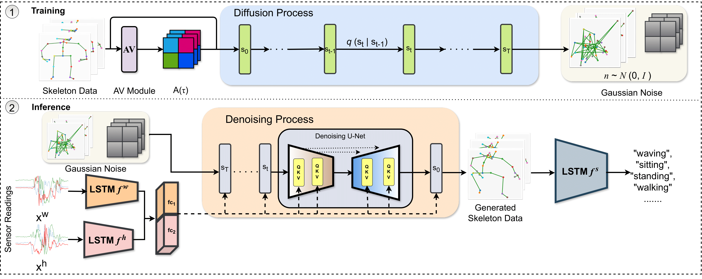

### SSDL: Sensor-to-Skeleton Diffusion Model with Lipschitz Regularization for Human Activity Recognition ###

This repository contains the implementation of **SSDL**, a Sensor-to-Skeleton Diffusion Model, for generating skeleton data from sensor inputs to perform **Human Activity Recognition (HAR)**. The model incorporates **Angular Variations** and **Lipschitz Regularization** to improve accuracy and robustness on noisy sensor data.

## Introduction
SSDL is a diffusion-based model designed to generate skeleton data conditioned on wearable sensor data. It addresses key challenges in sensor-based HAR, such as noise and instability, by employing **Lipschitz Regularization** to improve the robustness of generated data. SSDL has been tested on three benchmark datasets: **UTD-MHAD**, **Berkeley-MHAD**, and **SmartFall-MHAD**, showing state-of-the-art performance.



## Features
- **Cross-modal generation**: Generates skeleton key points from sensor inputs.
- **Angular Variations Module**: Extracts key joint movements to guide diffusion.
- **Lipschitz Regularization**: Stabilizes the model's performance with noisy sensor inputs.

## Installation
1. Clone the repository:
    ```bash
    git clone https://github.com/nikhiliit/SSDL-S2S-Diffusion-Model-with-LR-for-HAR.git
    cd SSDL-S2S-Diffusion-Model-with-LR-for-HAR
    ```

2. Install dependencies:
    ```bash
    pip install -r requirements.txt
    ```

The training code in this repository utilizes **Distributed Data Parallel (DDP)** in PyTorch to take advantage of multiple GPUs for faster training. DDP replicates the model on each GPU and synchronizes gradients across devices, which helps to scale training efficiently without sacrificing performance.

### Requirements for Running DDP Code:
- **Multiple GPUs**: To use DDP, your system must have multiple GPUs (or use multiple nodes with one or more GPUs per node).
- **NCCL**: DDP typically uses NCCL as the backend for communication between GPUs.
- **Based on number of GPUs**: One can run the code  